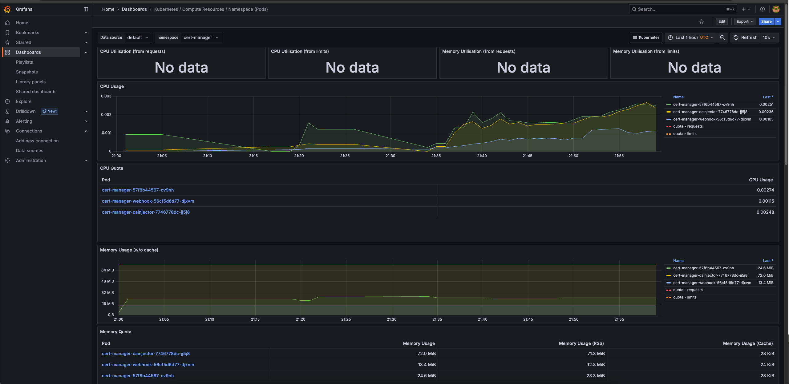
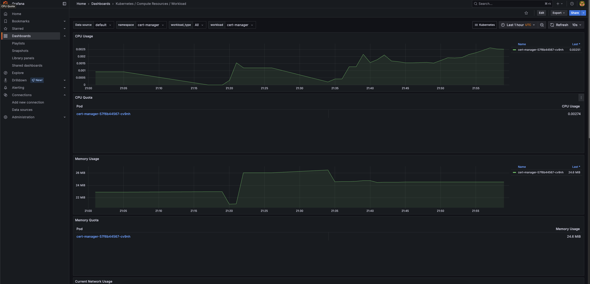
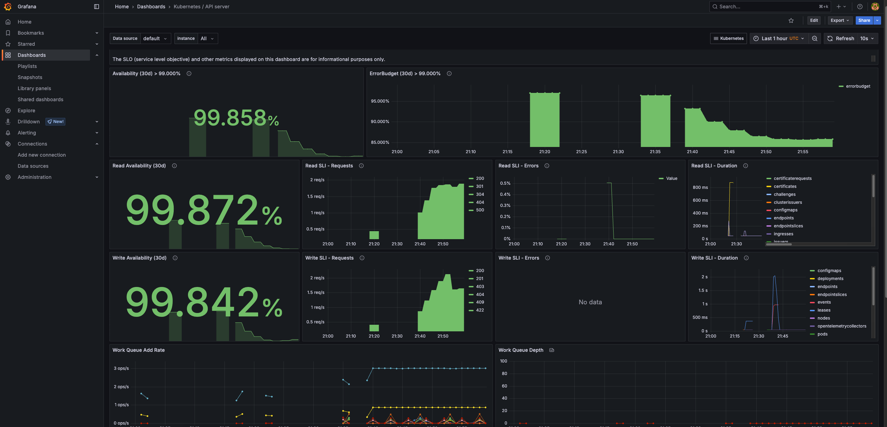
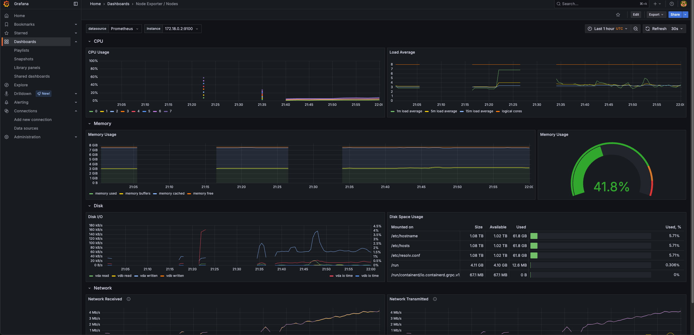
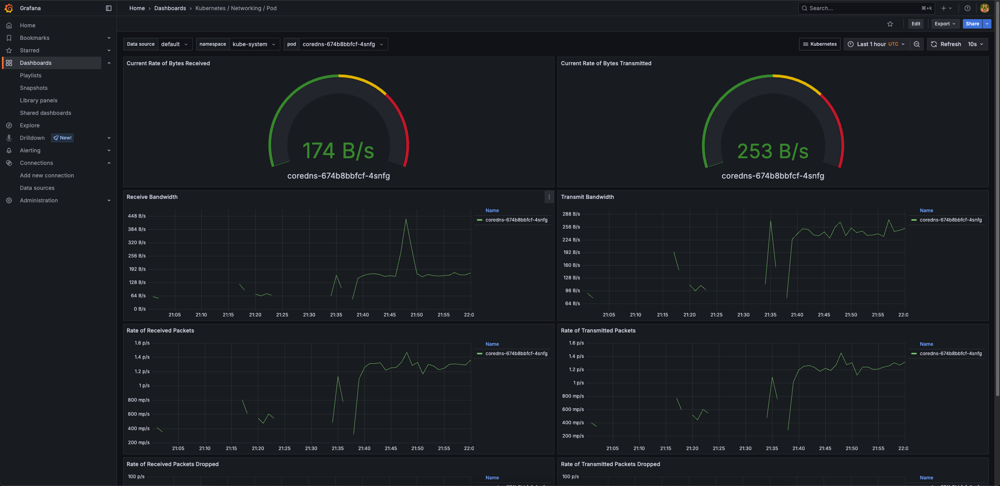

# OTel collector 

## Authors 

- [Kacper Ćwiertnia](https://github.com/kacpercwiertnia)
- [Mikołaj Pajor](https://github.com/Pejdzor)
- [Arkadiusz Mincberger](https://github.com/ArkadiuszMin)
- [Szymon Woźniak](https://github.com/szWozniak)

---

## 1. Introduction

The OpenTelemetry (OTel) Collector is a crucial component of the OpenTelemetry observability framework. It acts as a central point for collecting, processing, and exporting telemetry data (traces, metrics, and logs) from applications and infrastructure. It's designed to be configurable, extensible, and vendor-agnostic, allowing for seamless integration with various observability backends. 

---

## 2. Technology stack

- **Python** – drone flight simulator responsible for generating telemetry data.  
- **RabbitMQ** – message broker facilitating communication between the simulator and the backend.  
- **Java (Spring Boot)** – backend service that receives data from the simulator, stores it in the database, and exposes it via REST API.  
- **H2** – database which persists telemetry data received from the backend.  
- **React** – fronted that visualizes drone data retrieved from the backend.  
* **Kubernetes (K8s):** Container orchestration platform.
* **Kind (Kubernetes in Docker):** Tool for running local K8s clusters using Docker.
* **Docker:** Containerization platform.
* **kubectl:** Kubernetes command-line tool.
* **Helm:** Package manager for Kubernetes.
* **OpenTelemetry:**
    * **Collector:** Receives, processes, and exports telemetry data (OTLP receiver, Prometheus exporter).
    * **Operator:** Manages OpenTelemetry Collector instances in Kubernetes.
* **Prometheus:** Monitoring system and time-series database (via `kube-prometheus-stack`).
* **ServiceMonitor:** CRD for Prometheus Operator to discover scrape targets.
* **Grafana:** Visualization platform (via `kube-prometheus-stack`).
* **Cert-Manager:** Manages TLS certificates for K8s applications (dependency for OTel Operator).
* **NGINX Ingress Controller:** Manages external access to services, used here for OTLP TCP stream proxying.

---


## 3. Objective

The objective was to create a reproducible local Kubernetes environment for developing and testing applications that emit OpenTelemetry (OTLP) metrics. Key requirements included using the OpenTelemetry Collector and Grafana to implement obervability of application and collecting metrics. We wanted to expose the OpenTelemetry Collector and Grafana on `localhost` without manual port-forwarding to simulate real use scenario, where we can configure obervability just by using address.


---

## 4. Solution Architecture Overview

The solution uses a Kind cluster with the following key components:
* **NGINX Ingress Controller:** Exposes OTLP/gRPC (port 4317) and OTLP/HTTP (port 4318) from the host to the OpenTelemetry Collector service (ClusterIP) via TCP streams.
* **OpenTelemetry Collector:** Deployed by the OTel Operator, receives OTLP data via Ingress, and exports metrics to Prometheus.
* **kube-prometheus-stack:** Provides Prometheus (scraping the OTel Collector via a `ServiceMonitor`) and Grafana.
* **Grafana:** Exposed directly via a NodePort service, accessible on `localhost:3000`.


Image presents overall architecture of our application. 
- Drone-generating simulator is communicating with backend via RabbitMQ Queues informing about new files with drones' positions. 
- Both backend and simulator sends metrics about resource usages to collector.
- Python simulator sends data do Collector via HTTPS requests, while backend sends them via gRPC. This shows that OTEL Collector can listen to many communication protocol at once.
- Collector sends reports in batches via HTTPS to grafana.
- Grafana collects data, stores them and print pretty cool charts.


---

## 5. Environment Configuration

* **Key Tools & Versions (Examples):**
    * Kind: (User-installed version)
    * kubectl: (User-installed version)
    * Helm: (User-installed version)
    * Docker: (User-installed version)
    * Cert-Manager Helm Chart: `v1.14.5`
    * OpenTelemetry Operator Helm Chart: Latest stable from `open-telemetry/opentelemetry-helm-charts`
    * OpenTelemetry Collector Contrib Image: `otel/opentelemetry-collector-contrib:0.101.0`
    * kube-prometheus-stack Helm Chart: Latest stable from `prometheus-community/kube-prometheus-stack`
    * NGINX Ingress Controller Helm Chart: Latest stable from `ingress-nginx/ingress-nginx`

---

## 6. Installation Method

The environment is provisioned using:
1.  **Kind CLI:** For local Kubernetes cluster creation based on `cluster.yaml`.
2.  **Helm:** For installing Cert-Manager, NGINX Ingress Controller, OpenTelemetry Operator, and `kube-prometheus-stack`, configured via their respective `values.yaml` files.
3.  **kubectl:** For applying Cert-Manager CRDs and Custom Resources for OpenTelemetry Collector and ServiceMonitor.
An automated bash script (see Section 7) orchestrates these steps.

---
## 7. Reproducing the Setup (Step-by-Step Script)

## How to setup everything locally
Prerequisites:
- kind
- kubectl
- docker
- helm


### To start kind cluster: 

0. ### Try using provided script
```
./run_cluster.sh
```
This script should work on every Unix operating system

If this script failed even when you have all required tools, try following steps:

1. ### Start cluster
```
kind create cluster --config kubernetes/cluster.yaml
```

2. ### Set kubectl context
```
kubectl cluster-info --context kind-observability-cluster
```

3. ### Add helm repos
```
helm repo add jetstack https://charts.jetstack.io\
helm repo add prometheus-community https://prometheus-community.github.io/helm-charts\
helm repo add ingress-nginx https://kubernetes.github.io/ingress-nginx\
helm repo update
```

4. ### Install Cert-manager
```
kubectl apply -f https://github.com/cert-manager/cert-manager/releases/download/v1.14.5/cert-manager.crds.yaml
helm install cert-manager jetstack/cert-manager \\
  --namespace cert-manager \\
  --create-namespace \\
  --version v1.14.5 \\
  --wait
```
Make sure that all pods are in state READY or RUNNING (`kubectl get pods -n cert-manager`)


5. ### Install & Configure ingress controller
```
helm install ingress-nginx ingress-nginx/ingress-nginx \\
  --namespace ingress-nginx \\
  --create-namespace \\
  --values kubernetes/ingress-values.yaml \\
  --wait
```

6. ### Install Prometheus & Grafana
```
helm install monitoring prometheus-community/kube-prometheus-stack \\
  --namespace monitoring \\
  --create-namespace \\
  --values kubernetes/monitoring-values.yaml \\
  --wait
```
7. ### Install OTEL-Collector Operator
```
helm install opentelemetry-operator open-telemetry/opentelemetry-operator \\
  --namespace opentelemetry-operator-system \\
  --create-namespace \\
  --wait
```

8. ### Create OTEL Collector
```
kubectl apply -f kubernetes/otel-config.yaml -n default
```

9. ### Create Service Monitor
```
kubectl apply -f kubernetes/otel-collector-service-monitor.yaml -n monitoring
```

## 7.1 Infrastructure as Code Notes
This setup embodies Infrastructure as Code (IaC) principles:

* **Declarative** Configuration: All components are defined in YAML files, describing the desired state.
* **Automation**: The deploy_all.sh script automates the entire environment setup.
* **Version** Control: All YAML files and scripts can be versioned using Git for traceability and collaboration.
* **Reproducibility**: The scripted and declarative nature ensures the environment can be consistently recreated.

## 8. Demonstration Steps
## 8.1 Configuration Setup
Run the `run_cluster.sh` script as described in Section 7. This will create the Kind cluster and deploy all necessary observability components.

## 8.2 Sample Data Generation
An external application (our BSc project to be precise) prepared and configured to report metrics.

This application would generate sample metrics (e.g., CPU usage, custom application counters).

## 8.3 Execution Procedure
Execute ./run_cluster.sh and wait for completion of cluster setup.
Start rabbitMQ broker with command:
```
docker run -d --name dronhub_rabbitmq -p 5672:5672 -p 5673:5673 -p 15672:15672 rabbitmq:3-management  
```

In one terminal start Python simulator:
```
cd simulator
pip3 install -r requirements.txt
python3 simulator.py
```

In second terminal start Java application:
```
cd backend
./gradlew run --args='--spring.profiles.active=develop'
```


## 8.4 Results Presentation


Prometheus UI:
\
Port-forward: kubectl port-forward svc/prometheus-operated -n monitoring 9090:9090
\
Open http://localhost:9090.
\
Check Status > Targets to ensure the OTel Collector target is UP.

Grafana:\
Open http://localhost:3000 (login: admin/admin).\
Configure a new dashboard or explore existing ones.

---

## 9. Use of AI in the Project
Gemini (Google AI assistant) was utilized throughout this project for:

* Generating initial configurations and setup steps.
* Troubleshooting complex issues related to Kubernetes networking (Kind extraPortMappings), OpenTelemetry Operator CRD behavior,      Ingress Controller TCP stream proxying, and Prometheus ServiceMonitor configurations.
* Refining YAML configurations and bash scripts.
* Explaining error messages and Kubernetes concepts.
* Consolidating the entire process into this documentation.

---

## 10. Summary & Conclusions
This project successfully demonstrated the setup of a local Kubernetes-based observability stack using Kind, OpenTelemetry, NGINX Ingress, Prometheus, and Grafana. External access to the OpenTelemetry Collector (via Ingress) and Grafana (via NodePort) on localhost was achieved without requiring manual kubectl port-forward.

The main challenge involved correctly configuring the OpenTelemetry Operator and its to work with Kubernetes service exposure mechanisms, ultimately leading to the Ingress-based solution for the OTel Collector.

The resulting environment is reproducible and serves as a valuable platform for developing and testing applications with OpenTelemetry.

Exploring power of oberservability in modern application showed us, that Site Reliability Engineering is important and it's not some mysthic knowledge reserver for only few, but with modern and well documented tools it can be easy to setup, reproduce and understand.

---

## 11. References

* Kind: https://kind.sigs.k8s.io/
* Kubernetes: https://kubernetes.io/docs/
* Helm: https://helm.sh/docs/
* OpenTelemetry: https://opentelemetry.io/docs/
* OpenTelemetry Operator: https://github.com/open-telemetry/opentelemetry-operator
* Prometheus: https://prometheus.io/docs/
* Grafana: https://grafana.com/docs/grafana/latest/
* Cert-Manager: https://cert-manager.io/docs/
* NGINX Ingress Controller: [podejrzany link usunięto]

## Grafana view:
### Resource usage by pods

### Resource usage by workload


### SLI of API requests


### Nodes metrics from Kubernetes


### Network usage and transfer by Pods
