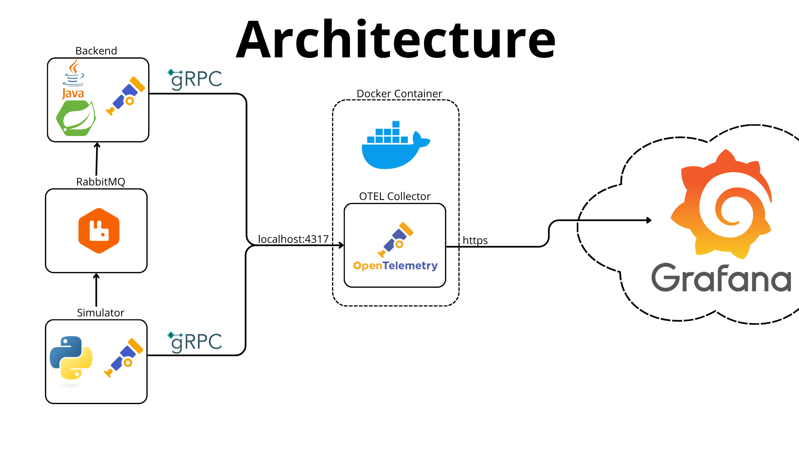

# OTel collector 

## Authors 

- [Kacper Ćwiertnia](https://github.com/kacpercwiertnia)
- [Mikołaj Pajor](https://github.com/Pejdzor)
- [Arkadiusz Mincberger](https://github.com/ArkadiuszMin)
- [Szymon Woźniak](https://github.com/szWozniak)

## Introduction

The OpenTelemetry (OTel) Collector is a crucial component of the OpenTelemetry observability framework. It acts as a central point for collecting, processing, and exporting telemetry data (traces, metrics, and logs) from applications and infrastructure. It's designed to be configurable, extensible, and vendor-agnostic, allowing for seamless integration with various observability backends. 

## Technology stack

- **Python** – drone flight simulator responsible for generating telemetry data.  
- **RabbitMQ** – message broker facilitating communication between the simulator and the backend.  
- **Java (Spring Boot)** – backend service that receives data from the simulator, stores it in the database, and exposes it via REST API.  
- **H2** – database which persists telemetry data received from the backend.  
- **React** – fronted that visualizes drone data retrieved from the backend.  
- **OpenTelemetry** – generates metrics from both the simulator and the backend.  
- **OTel Collector** – collects telemetry data (metrics) from applications via OTLP protocol.  
- **Grafana** – visualizes metrics collected by the OTel Collector.

## Architecture overview

Image presents overall architecture of our application. 
- Drone-generating simulator is communicating with backend via RabbitMQ Queues informing about new files with drones' positions. 
- Both backend and simulator sends metrics about resource usages to collector.
- Python simulator sends data do Collector via HTTPS requests, while backend sends them via gRPC. This shows that OTEL Collector can listen to many communication protocol at once.
- Collector sends reports in batches via HTTPS to grafana.
- Grafana collects data, stores them and print pretty cool charts.

## How to setup everything locally
Prerequisites:
- Download Grafana and install grafana
Tu start everything you need 4 terminals:

In terminal 1:
1. Start RabbitMQ brocker
`docker run -d --name dronhub_rabbitmq -p 5672:5672 -p 5673:5673 -p 15672:15672 rabbitmq:3-management`
2. Start Prometheus server
`docker run -d --name prometheus -p 9090:9090 -v ./prometheus/prometheus.yaml:/etc/prometheus/prometheus.yml prom/prometheus --config.file=/etc/prometheus/prometheus.yml --web.enable-remote-write-receiver`
3. Start Grafana server
On MacOS: download grafana from https://grafana.com/grafana/download
Extract downloaded file and go inside
run grafana with: 
`./bin/grafana server`

In terminal 2:

`sudo docker run -v ./otel/config.yaml:/etc/otelcol-contrib/config.yaml -v "/var/run/docker.sock:/var/run/docker.sock" -p 4317:4317 -p 4318:4318 otel/opentelemetry-collector-contrib:latest`

In terminal 3:

`cd simulator`
`pip install -r ./requirements.txt`
`python simulator.py`

In terminal 4:

`cd backend`
`./gradlew run --args='--spring.profiles.active=develop'`