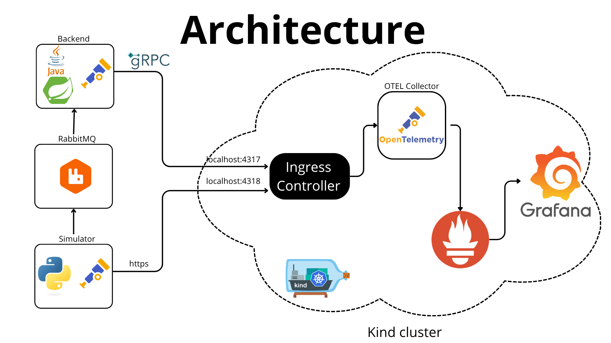

# OTel collector 

## Authors 

- [Kacper Ćwiertnia](https://github.com/kacpercwiertnia)
- [Mikołaj Pajor](https://github.com/Pejdzor)
- [Arkadiusz Mincberger](https://github.com/ArkadiuszMin)
- [Szymon Woźniak](https://github.com/szWozniak)

## Introduction

The OpenTelemetry (OTel) Collector is a crucial component of the OpenTelemetry observability framework. It acts as a central point for collecting, processing, and exporting telemetry data (traces, metrics, and logs) from applications and infrastructure. It's designed to be configurable, extensible, and vendor-agnostic, allowing for seamless integration with various observability backends. 

## Technology stack

- **Python** – drone flight simulator responsible for generating telemetry data.  
- **RabbitMQ** – message broker facilitating communication between the simulator and the backend.  
- **Java (Spring Boot)** – backend service that receives data from the simulator, stores it in the database, and exposes it via REST API.  
- **H2** – database which persists telemetry data received from the backend.  
- **React** – fronted that visualizes drone data retrieved from the backend.  
- **OpenTelemetry** – generates metrics from both the simulator and the backend.  
- **OTel Collector** – collects telemetry data (metrics) from applications via OTLP protocol.  
- **Grafana** – visualizes metrics collected by the OTel Collector.

## Architecture overview



Image presents overall architecture of our application. 
- Drone-generating simulator is communicating with backend via RabbitMQ Queues informing about new files with drones' positions. 
- Both backend and simulator sends metrics about resource usages to collector.
- Python simulator sends data do Collector via HTTPS requests, while backend sends them via gRPC. This shows that OTEL Collector can listen to many communication protocol at once.
- Collector sends reports in batches via HTTPS to grafana.
- Grafana collects data, stores them and print pretty cool charts.

## How to setup everything locally
Prerequisites:
- kind
- kubectl
- docker
- helm


### To start kind cluster: 

1. ### Start cluster
```
kind create cluster --config kubernetes/cluster.yaml
```

2. ### Set kubectl context
```
kubectl cluster-info --context kind-observability-cluster
```

3. ### Add helm repos
```
helm repo add jetstack https://charts.jetstack.io\
helm repo add prometheus-community https://prometheus-community.github.io/helm-charts\
helm repo add ingress-nginx https://kubernetes.github.io/ingress-nginx\
helm repo update
```

4. ### Install Cert-manager
```
kubectl apply -f https://github.com/cert-manager/cert-manager/releases/download/v1.14.5/cert-manager.crds.yaml
helm install cert-manager jetstack/cert-manager \\
  --namespace cert-manager \\
  --create-namespace \\
  --version v1.14.5 \\
  --wait
```
Make sure that all pods are in state READY or RUNNING (`kubectl get pods -n cert-manager`)


5. ### Install & Configure ingress controller
```
helm install ingress-nginx ingress-nginx/ingress-nginx \\
  --namespace ingress-nginx \\
  --create-namespace \\
  --values kubernetes/ingress-values.yaml \\
  --wait
```

6. ### Install Prometheus & Grafana
```
helm install monitoring prometheus-community/kube-prometheus-stack \\
  --namespace monitoring \\
  --create-namespace \\
  --values kubernetes/monitoring-values.yaml \\
  --wait
```

7. ### Create OTEL Collector
```
kubectl apply -f kubernetes/otel-config.yaml -n default
```

8. ### Create Service Monitor
```
kubectl apply -f kubernetes/otel-collector-service-monitor.yaml -n monitoring
```